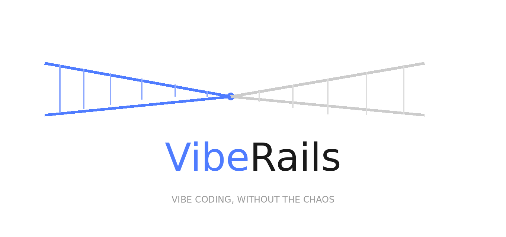

<div align="center">




**A self-hosted team contract engine for vibe coding — define ownership, enforce standards, and sync rules directly into your AI coding tool.**

<video src="assets/UI.mp4" controls width="800" loop style="border-radius: 12px; margin: 20px 0; box-shadow: 0 4px 20px rgba(0,0,0,0.15);"></video>

</div>

---

## Why VibeRails?

Vibe coding is fast. Team vibe coding is chaos.

When everyone on your team is using AI to write code simultaneously, you end up with:

- 🔴 **Merge conflicts** — two AIs edited the same file
- 🔴 **Semantic conflicts** — two AIs implemented the same function differently
- 🔴 **Style chaos** — no consistent naming, error handling, or structure
- 🔴 **Duplicate work** — nobody knew the other person already built it
- 🔴 **Boundary violations** — AI rewrote code it had no business touching

The root cause is simple: **your AI doesn't know your team's rules.**

VibeRails fixes that. Define your team contract once, sync it to every developer's AI tool automatically.

---

## Features

- 👤 **Ownership Declaration** — each developer declares which modules they own; AI stays in its lane
- 📋 **Team Standards** — shared coding style, naming conventions, and test requirements injected into every AI session
- 🔍 **Interface Registry** — scans and uploads public interfaces, tracks lifecycle status, owners, and planned APIs
- 🧭 **Contracts Workspace** — manage global standards, personal standards, and locked modules from one master-detail page
- 🧩 **Features Workspace** — group interfaces by feature, track ownership, and discuss implementation notes
- 🤖 **AI Chat** — per-feature AI discussion room. Supports Anthropic, OpenAI, DeepSeek, Qwen and any OpenAI-compatible provider
- 🐛 **Issue Tracker** — built-in issue board with status workflow, assignee management, and threaded comments
- 🔄 **Dynamic Updates** — standards evolve as the project grows; one sync command keeps everyone current
- 🖥️ **Web UI** — manage your team contract, members, and ownership from a browser
- ⚡ **CLI Sync** — `viberails sync` writes your personal contract directly into `.cursor/rules/`
- 🐳 **Self-Hosted** — your contract stays on your server; `docker compose up` and you're running
- 👤 **Solo-Friendly** — works just as well for individual developers who want consistent AI behavior

---

## Quick Start

**Prerequisites:** Python 3.12+ · Docker + Docker Compose · Cursor IDE

**Step 1: Deploy the server**

```bash
git clone https://github.com/rlin27/VibeRails.git
cd VibeRails
cp .env.example .env
docker compose up -d
```

Server is now running at `http://localhost:8000`. Open `http://localhost:8000/ui` to manage your team contract.

**Step 2: Install the CLI**

```bash
pip install viberails
```

**Step 3: Initialize your project**

```bash
cd your-project
viberails init
# Edit .vibrails.yml: set server address and your member_id
viberails scan --upload
viberails sync
```

Your personal contract is now live at `.cursor/rules/vibrails.mdc`. Cursor reads it automatically on every AI request.

---

## How It Works

```
Owner sets up team contract in Web UI
        │
        ▼
Each developer runs: viberails sync
        │
        ▼
CLI pulls contract from server
        │
        ▼
Writes to .cursor/rules/vibrails.mdc
        │
        ▼
Cursor injects it into every AI session
```

The generated `.mdc` file tells your AI:
- Which files it's allowed to touch
- What the team's coding standards are
- What public interfaces already exist
- Which modules are locked and off-limits

---

## Roadmap

- [x] Project scaffold + architecture design
- [x] Server: member management + contract storage
- [x] Server: sync API
- [x] Server: interface registry auto-scan
- [x] CLI: `viberails init` + `viberails scan --upload` + `viberails sync`
- [x] `.mdc` file generation for Cursor
- [x] Web UI: Overview, Contracts, and Interfaces & Features workspaces
- [x] Docker Compose deployment
- [ ] Persist feature discussions and interface-feature links on the server
- [ ] Support for additional IDE targets (Claude Code, GitHub Copilot)
- [ ] AI-powered code review *(post-MVP)*
- [ ] AI-powered test generation *(post-MVP)*

---

*Your AI should know the rules before it writes the code.*

</div>

## Acknowledgements

Built with the assistance of [Claude](https://claude.ai) (Anthropic) and [Cursor](https://cursor.com) (Anysphere).